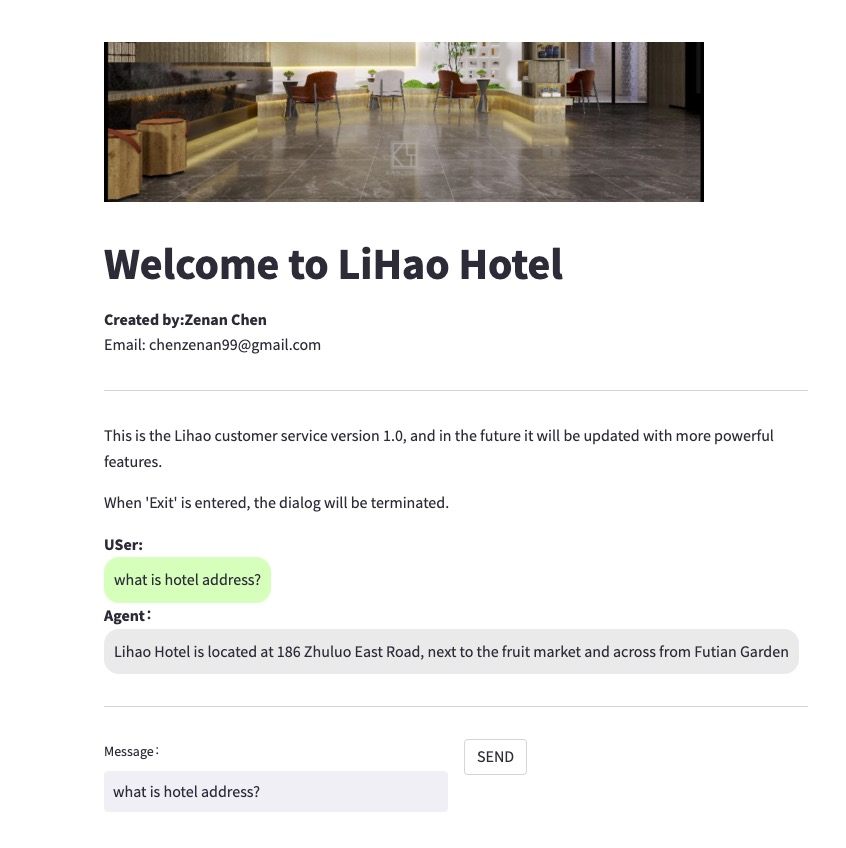

# Hotel Agent


# Pipeline : 
1.Train  virtual assistant model  

2.Create a virtual assistant using EU2

3.Integrate speech APIs

4.Output responses using model:The response can then be passed through the text-to-speech API to convert it to speech and output it to the customer.

# Problem Statement
The hotel front desk often lacks staff or has poor service attitudes, resulting in difficulty receiving feedback from customers .This can lead to lower from customers satisfaction and decreased business for the hotel


# Data Source

Data Source Usage
This repository contains a dataset in TXT format that can be used to generate hotel customer service conversations using ChatGPT. The TXT file includes a prompt with hotel information, and the generated conversations between customers and customer service representatives.
```bash
python data/GPT_generate_data.py  (openai_key, hotel_information) ->Generate a large amount of dialogue text in DialogueText file
```
Prompt: Hotel Information
generate customer service conversations +hotel information 
For example:{Hotel Name: The Grand Hotel,Address: 123 Main St, Anytown US,Phone Number: 555-1234RoomRates: $200 - $400 per nightAmenities: Pool, Gym, Restaurant}


Generating Conversations  
To generate customer service conversations using this dataset, you can input the prompt into your ChatGPT model and let it generate the responses. The generated conversations are included in the TXT file.
Extracting Questions and Answers
To extract the questions and answers from the generated conversations in the TXT file, you can use a script or tool to parse the file and extract the text between the customer and customer service representative(CSV file).

```bash
   data/Extract_QandA.py  -> QANDA.csv
```

Labeling customer questions using GPT.  -- 2K_labels.csv
 {1: Reservation, 2: Payment, 3: Check out, 4: Another} 
 prompt :"Label this sentence as {1: Reservation, 2: Payment, 3: Check out, 4: Another} return  number"+Questions
 
```bash
   data/generate_qanda_label_file.py (QANDA_label.csv,openai_key)  -> QANDA_label.csv
```

# Modeling Approaches

## Non-Deep Learning :  Classification_TFIDF
Training customer question tags using TFIDF has an accuracy of 0.737 on the training set and 0.650 on the test set. This has a significant impact on adding data in the future.


## Non-Deep Learning :  TFIDF
A non-machine learning approach based on Term Frequency and Inverse Document Frequency (TF-IDF) weighting was performed on the question feature of the dataset. In particular, a vocabulary was first generated by processing the questions and creating a list of unique words. This vocabulary was then fitted to a TF-IDF vectorizer (from Scikit-Learn) to create a TF-IDF weighted document matrix. The query of interest is preprocessed, tokenized, and lemmatized before being turned into a vector using the same TF-IDF vectorizer. This query vector is then compared to each document in the TF-IDF matrix based on cosine similarity. The most similar results are returned as recommendations along with their respective similarity scores.

Decent recommendations are observed if the query terms are not super rare or archaic. For example, if you entered terms that did not occur much or at all in the vocabulary of questions, the cosine similarity scores are likely to be very low, and the results would probably not be of much interest.


## Deep Learning :DialoGPT-large model
This is a project that trains a conversational AI model to act as a hotel agent chatbot. The model is based on the DialoGPT-large pre-trained language model, and is fine-tuned on a CSV dataset of customer queries and hotel agent responses. BLUE: 0.6


## Demo 



```bash
   dstreamlit run app.py --server.port=8080 --server.address=0.0.0.0
```
